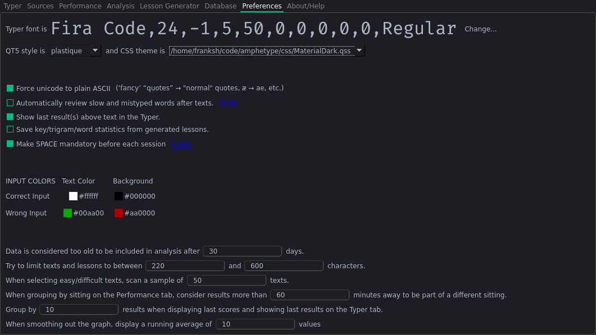
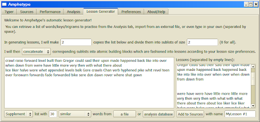

# Amphetype

Amphetype is an advanced typing practice program.

Features include:

* Type your favorite novel!

  One of the core ideas behind Amphetype was to not just use boring
  "stock texts" for typing practice, but to allow me to practice on
  texts that I actually want to read. So one feature is the ability to
  import whole novels (for example from [Project
  Gutenberg](https://www.gutenberg.org/)) and have Amphetype
  automatically generate bite-sized lessons from the text. For
  example, when I was learning the [Colemak](https://colemak.com/)
  keyboard layout, I typed _The Metamorphosis_ by Franz Kafka!

* Typing statistics.

  It provides the basic typing statistics (accuracy and WPM) across
  keys, trigrams, and words. It also tries to identify parts that
  break your flow and what impact these "viscous" combinations have on
  your typing speed overall. It also shows a graphs of progress over
  time.

* Generate lessons from past statistics.

  Amphetype features an advanced lesson generator where you can
  generate texts based on your past performance. Generate blocks of
  text to target practice your slowest words, trigrams, or keys!

* Layout-agnostic.

  Amphetype doesn't care _what_ keyboard or layout you use, it only
  looks at _how_ you use it.

* Highly customizable in functionality, looks, and feel.

# Installing

## GNU/Linux

Easiest is to install via `pip`[^1] or `pipx`[^2]:

```bash
$ pip install --user amphetype
```

Note that Amphetype requires at least Python 3.6+.

**The most recent version (1.2.x) on PyPi could be considered BETA as
it features a major update and overhaul and a new typing widget.
You can specify the old version with `amphetype==1.0.1`.**

## Windows

Check out the releases for an installer.

Making Windows installations is a bit painful for me since I don't have regular
access to Windows for testing. As a last resort you could try using [Linux in
Windows](https://www.microsoft.com/en-us/p/ubuntu/9nblggh4msv6).

## MacOS

... nor do I have access to a Mac, so here I will pretty much just copy
instructions out of Google, because I have no experience.

(If you're an experienced user, the Linux instructions above
are probably enough for you.)

1. First install [Homebrew](https://brew.sh/) if you don't have it.
2. Then (in the terminal app) install Python 3 if you don't have it:
   ```bash
   $ brew install python
   ```
3. I've encountered at least one user who had to manually install `pyqt5`:
   ```bash
   $ brew install pyqt5
   ```
   Not sure if this is necessary, or indeed if it installs its own Python, thus
   making step #2 redundant.
4. Either way, hopefully you will now either:
   1. Have a command called `pip` (or `pip3`?), so
      use that like in the Linux instructions:
      ```bash
      $ pip install --user amphetype
      ```
   2. OR, if not, you should at least have Python
      so you could try:
      ```bash
      $ python3 -m pip install amphetype
      ```
      (The command might be `python3.9` or `python3.10` or `python`.)
5. Run the program:
   ```bash
   $ amphetype
   ```
   (I'm not sure if it shows up in Finder?)

If a OSX dev is willing to write better and less confusing instructions, let me
know!

### MacOS with uv

1. Create a virtual environment and activate it:

```sh
# create a virtual environment with Python 3.11 to support pyqt5
uv venv venv --python 3.11

source venv/bin/activate
```

2. Install the requirements:

```
uv pip install -r requirements.txt
```

3. Install amphetype within the environment

```
# Install amphetype as an editable package
uv pip install e .
```

4. Launch the amplication

```
python -c "from amphetype.main import main_normal; main_normal()"
```

# Resurrected?

Yes, I originally made this program 12 years ago
[here](https://code.google.com/archive/p/amphetype/). I've updated it
somewhat and implemented some features that were requested back then,
and upgraded the code to use Python 3 and Qt5 (instead of Python 2 and
Qt4).

Google Code has gone read-only though, so I am unable to do anything
about what's shown there.

# Other Links

Review of (old) Amphetype: https://forum.colemak.com/topic/2201-training-with-amphetype/

My own inspiration for switching to a different keyboard layout and why I made Amphetype:

* http://steve-yegge.blogspot.com/2008/09/programmings-dirtiest-little-secret.html

* https://blog.codinghorror.com/we-are-typists-first-programmers-second/

* https://www.ryanheise.com/colemak/

# Screenshots

**TODO**: make more attractive screenshots.

Using various themes:






[^1]: If you get something like "command not found," replace all instances of
    `pip` with `python -m pip`. If _that_ gives an error like "module not
    found," try `python -m ensurepip` first.

[^2]: You could also try using `pipx` which isolates installations in its own
    virtual environment, so dependencies do not interact with the rest of your
    system.
